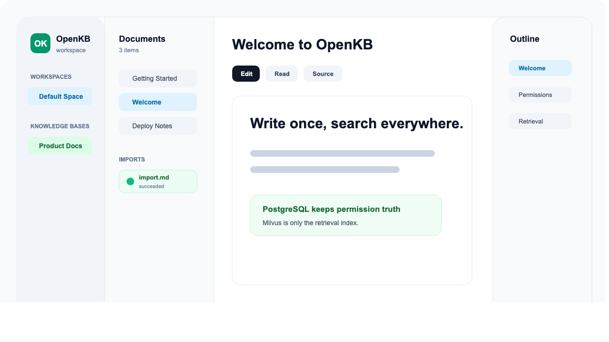
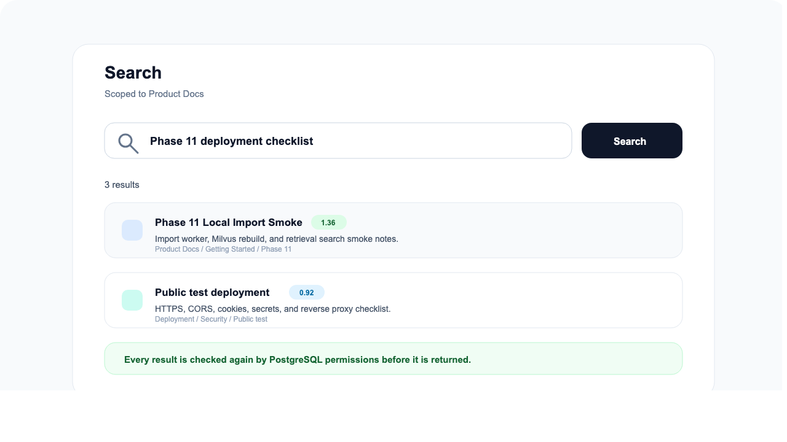
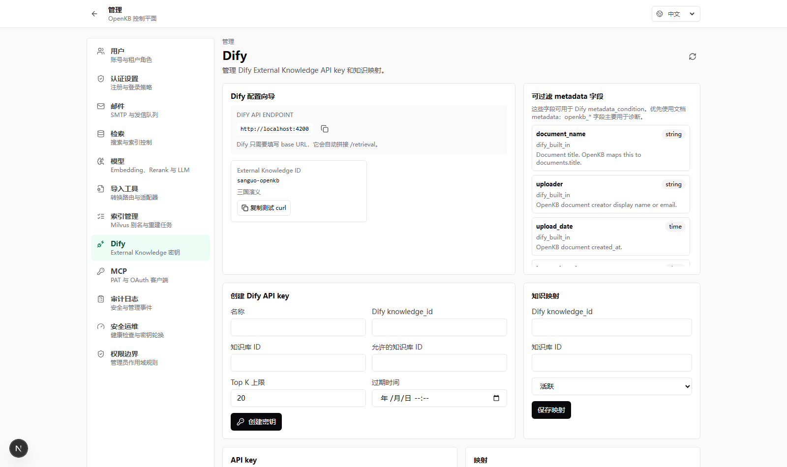
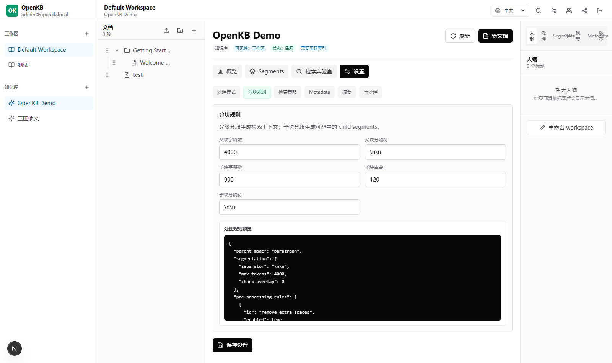

# OpenKB

OpenKB is a Markdown-first, self-hostable knowledge base for teams that need Yuque-style writing, controlled sharing, retrieval, and Dify External Knowledge integration.

OpenKB keeps documents, versions, collaborators, shares, audit logs, and permissions in PostgreSQL. Milvus is a rebuildable retrieval index. Web search, MCP, Dify, export, and attachment reads all return to PostgreSQL for final permission checks.

[Quick Start](#quick-start) · [Deployment](docs/13-deployment.zh-CN.md) · [Documentation](docs/00-index.zh-CN.md) · [Dify Setup](docs/26-dify-external-knowledge-setup.zh-CN.md) · [Roadmap](docs/15-roadmap-and-codex-tasks.zh-CN.md)

## Status

Current line: `v0.3.x / Phase 31` with the latest auth and import UX updates.

The current build includes:

- Personal spaces, team spaces, workspace switcher, workspace dashboards, and workspace-owned knowledge bases.
- Yuque-style permission entry points for workspace members, knowledge base visibility and collaborators, document permissions, and read-only share links.
- Dify External Knowledge adapter plus Dify Hub for Service API dataset discovery, external dataset management, and metadata sync.
- Dify-style knowledge processing settings: text, parent-child, QA, explicit reprocess, segment management, summary, QA, and asset-derived retrieval rows.
- User-bound MCP over Streamable HTTP, OAuth/PAT, and a local `openkb-mcp` stdio bridge for Codex, OpenClaw, Claude Code, and other MCP clients.
- Login registration controls: backend registration switch, login-page registration switch, invite-only mode, and email domain whitelist.
- Import job tracking: queued/running/succeeded/failed status, source filename, warnings, errors, and stale MinerU/import-worker diagnostics.
- Current-page language switching in the workbench.

OpenKB is ready for local development, private evaluation, and internal test deployments. It is not marked as production GA.

## Key Features

**Yuque-style workspace model**

- Personal space and team space are both represented by `workspace`.
- A knowledge base belongs to one workspace.
- The default workspace from older deployments is treated as a team space; migration reports are read-only and do not move private content.

**Markdown-first editor**

- Milkdown rich-text editing with reading, editing, and source modes.
- Markdown remains the editable body truth.
- Segments, QA, summaries, and asset indexes are retrieval-derived data and never rewrite document Markdown.

**Search and retrieval**

- PostgreSQL stores content and permissions.
- Milvus stores rebuildable retrieval indexes.
- BM25 is the default local path; dense, hybrid, and rerank require configured instance-level models and index rebuild.
- Every result passes a final PostgreSQL permission check.

**Dify integration**

- OpenKB can serve Dify External Knowledge `/retrieval`.
- Dify keys are scoped to allowed knowledge bases and cannot impersonate OpenKB users.
- Dify Hub uses the Dify Dataset Service API to manage external datasets and metadata fields. It does not use Console cookies and does not write the Dify database.

**Admin control plane**

- Instance-level model, SMTP, Dify, import-tool, MCP, indexing, auth, and audit settings.
- Raw secrets are never returned by API responses or written to audit logs.
- Admins can manage metadata in scope, but private body access still requires explicit audited takeover.

## Preview

| Workbench                                             | Search                                          |
| ----------------------------------------------------- | ----------------------------------------------- |
|  |  |

| Dify setup                                              | KB processing settings                                    |
| ------------------------------------------------------- | --------------------------------------------------------- |
|  |  |

## Quick Start

Requirements:

- Docker
- Docker Compose
- Node.js and pnpm only when developing from source

Start with Docker Compose:

```bash
cp .env.example .env
docker compose --env-file .env -f deploy/docker-compose/compose.yml up -d postgres redis minio-assets milvus-etcd milvus-minio milvus-standalone
docker compose --env-file .env -f deploy/docker-compose/compose.yml run --rm migrate
docker compose --env-file .env -f deploy/docker-compose/compose.yml run --rm seed-dev
docker compose --env-file .env -f deploy/docker-compose/compose.yml up -d
```

Open `http://localhost:3000`.

Development seed account:

```text
admin@openkb.local
OpenKB-dev-123456
```

For source development, use fixed local ports:

```powershell
pnpm dev:local:api
pnpm dev:local:web
```

Source mode defaults:

```text
Web: http://localhost:3100
API: http://localhost:4101
```

Do not run `next dev` and `next build` for the same web app at the same time; both use the same `.next` directory.

## Upgrade Acceptance

`/health.phase` is display-only. Use migrations, schema, APIs, and smoke tests for upgrade acceptance.

For the current line, verify:

- Prisma migrations include `0014_account_setup_admin_visibility` through `0024_login_registration_entry`.
- Key workspace fields exist: `workspaces.kind`, `workspaces.personal_owner_user_id`, `workspaces.avatar_color`, `workspaces.avatar_initials`.
- Auth settings include `login_registration_enabled`.
- Dify Hub tables and mapping linkage exist: `dify_hub_connections`, Dify dataset linkage fields on mappings.
- Retrieval-derived data fields exist: `document_chunks.index_role`, `document_chunks.source_chunk_id`, `document_asset_bindings`.
- Key flows work after authentication: workspace dashboard, workspace create/update, knowledge base create, KB permissions, document permissions, document share links, import jobs, KB chunk settings, document processing, reprocess, segment management, QA, summaries, search, Dify `/retrieval`, and Dify Hub metadata sync.
- Old derived data is rebuilt manually: explicit document reprocess first, then Milvus blue-green index rebuild.

## Documentation

- [Documentation index](docs/00-index.zh-CN.md)
- [Product vision](docs/01-product-vision.zh-CN.md)
- [Permission model](docs/05-permission-spec.zh-CN.md)
- [Auth and registration](docs/06-auth-registration.zh-CN.md)
- [Data model](docs/07-data-model.zh-CN.md)
- [Search and Milvus](docs/09-search-rag-milvus-native.zh-CN.md)
- [File import](docs/12-import-conversion.zh-CN.md)
- [Deployment](docs/13-deployment.zh-CN.md)
- [UI routes](docs/14-ui-routes.zh-CN.md)
- [Dify External Knowledge setup](docs/26-dify-external-knowledge-setup.zh-CN.md)
- [Workspace and knowledge base model](docs/32-yuque-space-kb-model.zh-CN.md)
- [Workspace migration runbook](docs/33-workspace-migration-compatibility.zh-CN.md)
- [Local quick start](docs/25-local-quickstart.zh-CN.md)

## Releases

- [`phase-21`](https://github.com/qdivan/OpenKB/releases/tag/phase-21): Dify External Knowledge experience improvements.
- [`phase-22`](https://github.com/qdivan/OpenKB/releases/tag/phase-22): Dify-style knowledge processing and retrieval settings.
- [`phase-25`](https://github.com/qdivan/OpenKB/releases/tag/phase-25): chunk settings, QA, image and attachment retrieval, and retrieval validation.
- [`phase-25.1`](https://github.com/qdivan/OpenKB/releases/tag/phase-25.1): workbench and Dify setup stabilization.
- [`phase-26`](https://github.com/qdivan/OpenKB/releases/tag/phase-26): Dify Hub, metadata sync, and workspace roadmap.

## Development Checks

```bash
corepack enable
pnpm install --frozen-lockfile
pnpm docs:check
pnpm format:check
pnpm typecheck
pnpm lint
pnpm build
pnpm test
```

Run the focused suites when touching the corresponding surface:

```bash
pnpm auth:test
pnpm content:test
pnpm import:test
pnpm retrieval:test
pnpm dify:test
pnpm mcp:test
```

`auth:test`, `content:test`, and `import:test` manage local test services. Run them serially to avoid one suite tearing down another suite's test database.

## MCP Clients

OpenKB exposes a user-bound MCP server at `/mcp`. Remote clients can use OAuth or PAT directly. Local stdio-only clients can use the bridge:

```bash
openkb-mcp probe --server-url https://kb.example.com/mcp --pat-env OPENKB_MCP_PAT
openkb-mcp install --client codex --server-url https://kb.example.com/mcp --pat-env OPENKB_MCP_PAT --output ./openkb-mcp.json
```

The generated config references an environment variable and does not write raw PATs. The portable agent skill lives in `integrations/skills/openkb-mcp/`.

## Boundaries

- PostgreSQL and `PermissionService` are the final content and permission truth.
- Milvus is a retrieval index, not an authorization source.
- MCP is user-bound. Dify is app-key-bound.
- Knowledge base owners cannot configure model secrets.
- Models, SMTP, Dify Hub tokens, and import-tool credentials are instance-level encrypted settings.
- Admin status is not private content access. Emergency takeover must be explicit and audited.
- Share links are read-only in v0.x.
